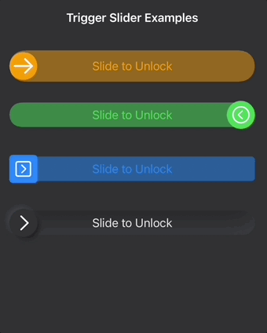

# TriggerSlider


 TriggerSlider is a simple SwiftUI trigger slider ("slide to open") which can be used instead of a button, e.g. in a situation where the user might accidentially tap a button with undesirable effects.
Minimum requirement is iOS 14. 


## Example project

This repo only contains the Swift package, no example code. Please download the example project [here](https://github.com/DominikButz/TriggerSliderExampleExample.git).


## Features

* Create your own slider view, background and text view and simply pass it into the initialiser.
* By changing the setting properties (TriggerSliderSettings), you can customize the following properties:
    - sliderViewHeight
    - sliderViewWidth
    - sliderViewHPadding
    - sliderViewVPadding
    - slideDirection // left or right

    Check out the examples for details. 


## Installation


Installation through the Swift Package Manager (SPM) or cocoapods is recommended. 

SPM:
Select your project (not the target) and then select the Swift Packages tab. Search for 'https://github.com/DominikButz/TriggerSlider.git' and add the master branch. 


Check out the version history below for the current version.


Make sure to import TriggerSlider in every file where you would like to create a TriggerSlider. 

```Swift
import TriggerSlider
```

## Usage

Check out the following example. This repo only contains the Swift package, no example code. Please download the example project [here](https://github.com/DominikButz/TriggerSliderExampleExample.git) and add the Trigger Slider package as shown above. 


 
 


### Code example

When you create the slider view and the background view in the closures of the initialiser, make sure that you don't set their frames. The frames of these subviews will be set in the package code through the settings parameters "sliderViewHeight" and "sliderViewWidth". The background view frame is then calculated based on the sliderViewHeight + sliderViewVPadding and the total available width. However, you can set the width of the Trigger Slider itself (as .frame modifier after the closing bracket).

```Swift

        VStack {
            
            Text("Trigger Slider Examples").font(.system(.headline)).foregroundColor(.primary).padding()
            
            VStack {
                TriggerSlider(sliderView: {
                    RoundedRectangle(cornerRadius: 30, style: .continuous).fill(Color.orange)
                        .overlay(Image(systemName: "arrow.right").font(.system(size: 30)).foregroundColor(.white))
                }, textView: {
                    Text("Slide to Unlock").foregroundColor(Color.orange)
                },
                backgroundView: {
                    RoundedRectangle(cornerRadius: 30, style: .continuous)
                        .fill(Color.orange.opacity(0.5))
                }, offsetX: self.$simpleRightDirectionSliderOffsetX,
                  didSlideToEnd: {
                    print("Triggered right direction slider!")
                    self.alertPresented = true
                }, settings: TriggerSliderSettings(sliderViewVPadding: 5, slideDirection: .right)).padding(.vertical, 10).padding(.horizontal, 20)
                
                Spacer()
                
                TriggerSlider(sliderView: {
                    Circle().fill(Color.green)
                        .overlay(Image(systemName: "chevron.left.circle").font(.system(size: 25)).foregroundColor(.white))
                }, textView: {
                    Text("Slide to Unlock").foregroundColor(Color.green)
                },
                backgroundView: {
                    RoundedRectangle(cornerRadius: 30, style: .continuous)
                        .fill(Color.green.opacity(0.5))
                }, offsetX: self.$simpleLeftDirectionSliderOffsetX,
                  didSlideToEnd: {
                    print("Triggered left direction slider!")
                    self.alertPresented = true
                }, settings: TriggerSliderSettings(sliderViewVPadding: -5, slideDirection: .left)).padding(.vertical, 10).padding(.horizontal, 20)
                
                Spacer()
                
                TriggerSlider(sliderView: {
                    RoundedRectangle(cornerRadius: 5, style: .continuous).fill(Color.blue)
                        .overlay(Image(systemName: "chevron.right.square").font(.system(size: 25)).foregroundColor(.white))
                }, textView: {
                    Text("Slide to Unlock").foregroundColor(Color.blue)
                },
                backgroundView: {
                    RoundedRectangle(cornerRadius: 5, style: .continuous)
                        .fill(Color.blue.opacity(0.5))
                }, offsetX: self.$rectangularSliderOffsetX,
                  didSlideToEnd: {
                    print("Triggered rectangular slider!")
                    self.alertPresented = true
                }, settings: TriggerSliderSettings(sliderViewVPadding: -5, slideDirection: .right)).padding(.vertical, 10).padding(.horizontal, 20)
            
                
                // Neumorphic
                TriggerSlider(sliderView: {
                    Circle().fill(Color.Neumorphic.main)
                        .softOuterShadow(offset:4, radius: 3)
                        .overlay(Image(systemName: "chevron.right").font(.system(size: 25)).foregroundColor(.white))
                }, textView: {
                    Text("Slide to Unlock").foregroundColor(Color.Neumorphic.secondary)
                },
                backgroundView: {
                    RoundedRectangle(cornerRadius: 30, style: .continuous)
                        .fill(Color.Neumorphic.main)
                        .softInnerShadow(RoundedRectangle(cornerRadius: 30))
                }, offsetX: self.$neumorphicSliderOffsetX,
                  didSlideToEnd: {
                    print("Triggered left direction slider!")
                    self.alertPresented = true
                }, settings: TriggerSliderSettings(sliderViewVPadding: -5, slideDirection: .right)).padding(.vertical, 10).padding(.horizontal, 20)
                
            }.frame(maxHeight: 300)
            
            Spacer()
            
        }.alert(isPresented: $alertPresented) {
            Alert(title: Text("Slider Action"), message: Text("Slider Action"), dismissButton: Alert.Button.cancel(Text("Reset"), action: {
                withAnimation {
                    self.simpleLeftDirectionSliderOffsetX = 0
                    self.simpleRightDirectionSliderOffsetX = 0
                    self.rectangularSliderOffsetX = 0
                    self.neumorphicSliderOffsetX = 0
                }
            }))
        }.background(Color.Neumorphic.main)
            .onChange(of: self.colorScheme) { newValue in
                print("color scheme changed to \(newValue)")
                Color.Neumorphic.colorSchemeType = newValue == .dark ? .dark : .light
            }


```

## Change log

#### [Version 0.5](https://github.com/DominikButz/MinimizableView/releases/tag/0.5)
    First public release

## Author

dominikbutz@gmail.com

## License

MinimizableView is available under the MIT license. See the LICENSE file for more info.


